# Credit Card Customer Experience & Complaint Driver Analysis

A hypothesis-driven analysis of CFPB credit card complaints, combining **Python (pandas, NLP, sentiment scoring, statistical testing)**, **SQL business queries**, and a **Power BI dashboard** to identify what drives customer dissatisfaction in credit card servicing — and where GenAI/NLP can scale that understanding across thousands of unstructured complaint narratives.

This project was built as a portfolio piece targeting **CX / Customer Insights & Analytics roles** (e.g. American Express's *Analyst – Data Analytics, Customer Listening* team), where the core ask is turning ambiguous business questions into testable hypotheses, choosing the right analytical method, and delivering evidence-based recommendations — not just reporting.

---

## Business Problem

Credit card issuers receive thousands of complaints a year. Not all complaints are equally severe, and not every "resolution" actually leaves the customer satisfied. This project asks:

1. Which issue categories drive the most negative customer sentiment — and is that difference statistically meaningful, or just noise?
2. Does *how* a company resolves a complaint (monetary relief, explanation, etc.) actually correlate with how negative the customer sounded?
3. Is there a state-level or company-level concentration worth flagging as a servicing gap?
4. Can an LLM summarize *why* customers are upset in the worst category, at scale, without a human reading thousands of narratives?

---

## Dataset

**Source:** [CFPB Consumer Complaint Database](https://www.consumerfinance.gov/data-research/consumer-complaints/search/?product=Credit%20card%20or%20prepaid%20card) — filtered to *Credit card or prepaid card* complaints with a consumer narrative present.

- Raw export: ~1.3GB, read in chunks to avoid memory errors
- Filtered to complaints from **Jan 2023–Aug 2023** with a non-null narrative
- Final analysis set: **21,283 complaints**
- Cleaned dataset used for SQL analysis: `cc_complaints_clean.csv`

---

## Tech Stack

| Layer | Tools |
|---|---|
| Data wrangling & cleaning | Python (pandas, numpy) |
| NLP / Sentiment | TextBlob, regex |
| Statistical testing | scipy (one-way ANOVA) |
| Visualization (analysis) | seaborn, matplotlib |
| GenAI summarization | LLM-based narrative summarization |
| Business querying | SQL |
| Dashboard | Power BI |

---

## Part 1 — Python: Cleaning, Sentiment, Hypothesis Testing & GenAI

### 1. Load Raw Data
The raw CFPB export (~1.3GB) is read in 50k-row chunks, keeping only the columns needed and dropping rows without a narrative — so memory never holds the full file at once. Filtered down to `Credit card or prepaid card` complaints.


### 2. Clean Narrative Text
CFPB narratives contain redaction placeholders (`XX/XX/2023`, `XXXX`) inserted for privacy. These are stripped out with regex before any NLP is run, so they don't show up as noise in word frequency or sentiment scoring.

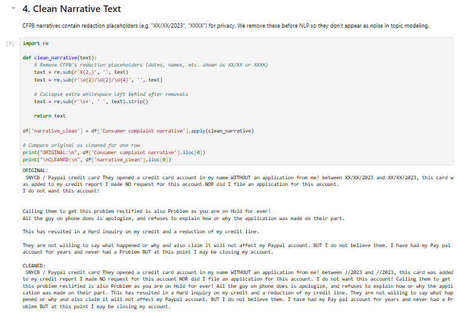

### 3. Sentiment Scoring
Each cleaned narrative is scored for polarity (-1 to +1) using **TextBlob** — a lexicon-based approach chosen for being simple, fast, and explainable (every word has a known polarity score, averaged across the text) rather than a black-box model.

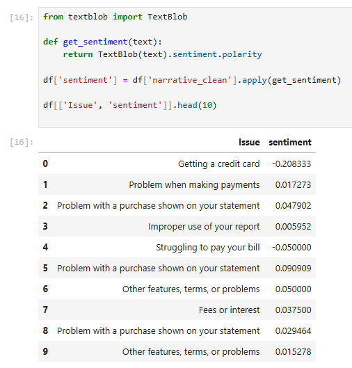

### 4. Sentiment by Issue Category
Aggregating average sentiment per issue type to see which complaint categories are most negative — the first data point toward testing the hypothesis that certain issue types drive more dissatisfaction than others.

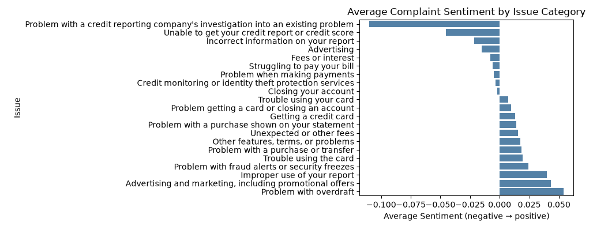

### 5. Hypothesis Test — Does Sentiment Really Differ by Issue Category?
**H0:** Average sentiment is the same across issue categories. **H1:** It differs significantly.
A one-way **ANOVA** was used to test whether the differences seen above are statistically meaningful or just noise.

> **Result:** F = 112.75, p < 0.001 → statistically significant difference in sentiment across issue categories.

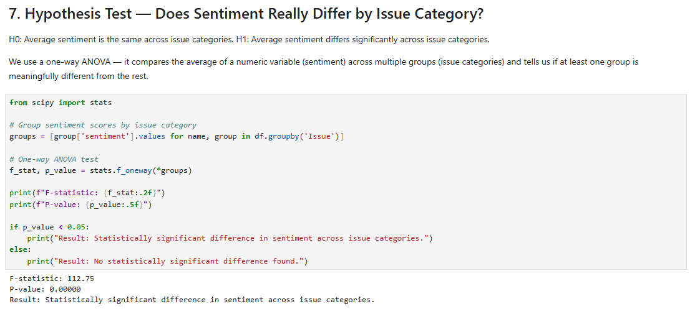

### 6. Sentiment vs. Company Response Type
Before testing statistically, the sentiment distribution was visualized across each company response type (closed with monetary relief, closed with explanation, etc.) to see whether more negative complaints get worse outcomes.

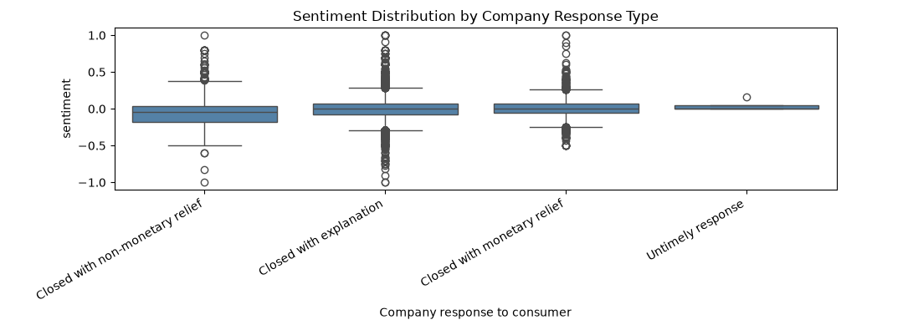

### 7. Hypothesis Test — Sentiment vs. Resolution Type
Same ANOVA approach applied to company response type.

> **Result:** F = 114.05, p < 0.001 → statistically significant, **but** the actual mean differences are small (all within ±0.05 on a -1 to +1 scale). With 21K+ complaints, even negligible differences can read as "significant" — so this is treated as a weak practical effect, not a strong CX driver. This distinction between statistical and practical significance was an intentional check, not an oversight.

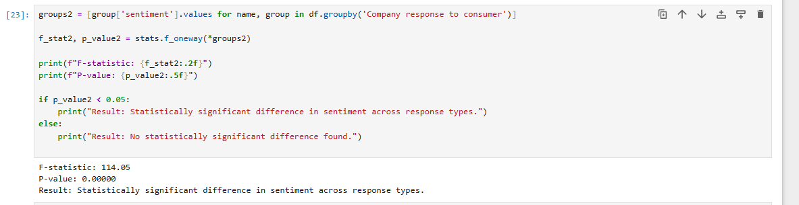

### 8. Root Cause — Word Frequency in the Worst-Sentiment Category
To understand *why* customers are most upset in the lowest-sentiment category (`Problem with a credit reporting company's investigation into an existing problem`), word frequency was run on that subset before summarizing with GenAI.

> Top terms: `account`, `late`, `never`, `payment`, `see`, `want`, `documents`, `attached`, `update`, `remove` — pointing to disputed late-payment marks and unresolved report-correction requests.

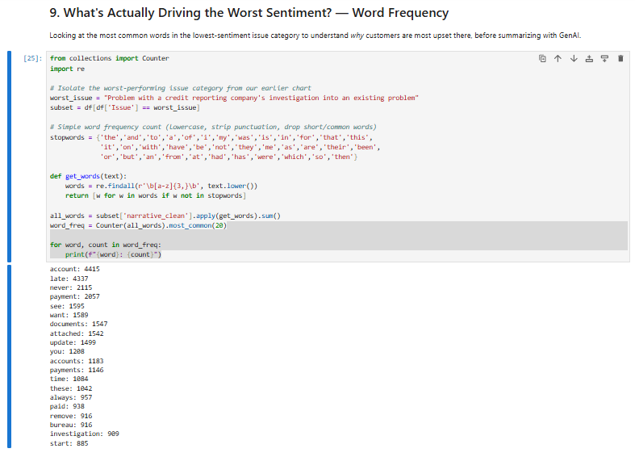

### 9. GenAI Summarization
Reading thousands of narratives manually isn't feasible, so an LLM was used to summarize a sample of 10 narratives from the worst-sentiment category — mirroring how GenAI is applied to unstructured customer data in a CX analytics workflow.

> **Summary:** Nearly all sampled complaints report a late-payment mark the customer insists is inaccurate, with documentation attached as proof and a consistent ask to have the entry investigated and removed. Several narratives were near-identical in wording, suggesting some may be filed via templated dispute letters rather than fully original complaints — a caveat worth flagging, even though the underlying issue is real and recurring.

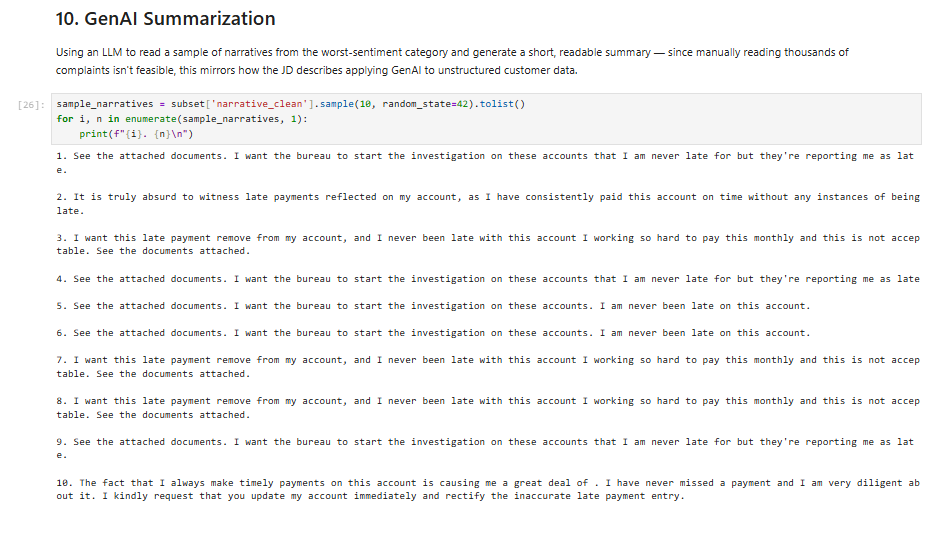

---

## Part 2 — SQL: Business Queries on the Cleaned Dataset

The cleaned output (`cc_complaints_clean.csv`, 21,283 rows) was loaded into a SQL table (`complaints`) to run the same core aggregations as business-facing queries — a SQL-first complement to the Python analysis.

### Setup — Select Database, Sanity Check Row Count, Confirm Schema
Confirms the data loaded correctly (21,283 rows) and checks exact column names (loaded via `df.to_sql`, so columns with spaces need backticks).


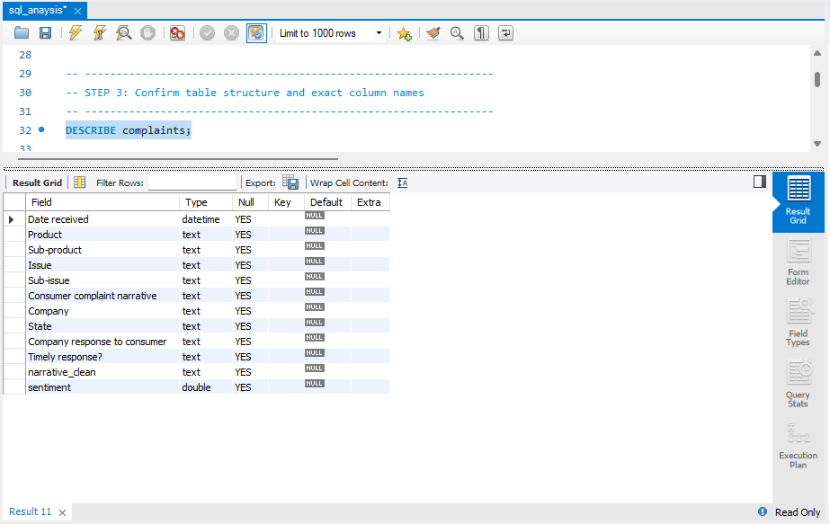

### Query 1 — Average Sentiment & Volume by Issue Category
SQL version of the Python groupby: which issue types generate the most negative sentiment, and how many complaints fall into each.

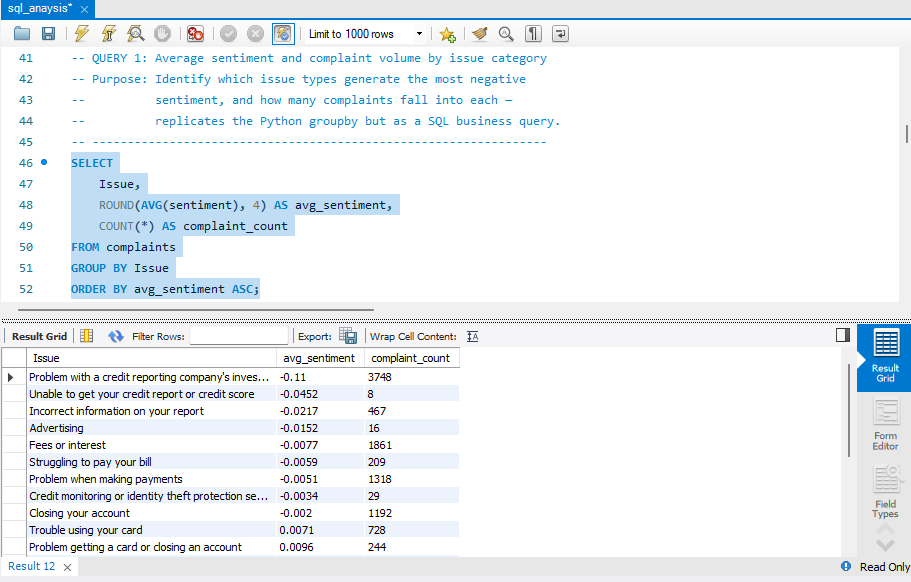

### Query 2 — Top 10 States for the Worst-Sentiment Issue
Checks whether the worst issue category (credit reporting investigation disputes) is geographically concentrated.

> **Finding:** Illinois alone accounts for ~28% of complaints in this category — far higher than population share would predict, and worth flagging as a possible regional or company-specific servicing gap.


### Query 3 — Average Sentiment by Company Response Type
SQL version of the ANOVA check — does resolution type relate to how negative the complaint was.


### Query 4 — Top 10 Companies by Complaint Volume
Identifies which companies receive the most complaints overall, for context on the dataset's composition.

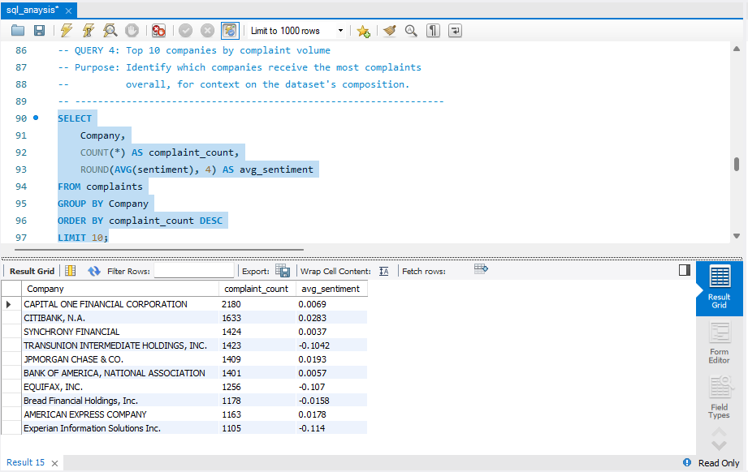

### Query 4b — American Express-Specific Issue Breakdown
Since this project targets an Amex analyst role, this checks whether Amex's own complaint pattern matches or diverges from the market-wide trend in Query 1.

> **Finding:** Amex's credit-reporting-dispute complaints run near-neutral in sentiment (n=11, too small to over-interpret), unlike the market-wide trend where this category is the worst performer. Amex's most reliable negative signal by volume is *"Fees or interest"* (n=148, avg sentiment -0.0141).

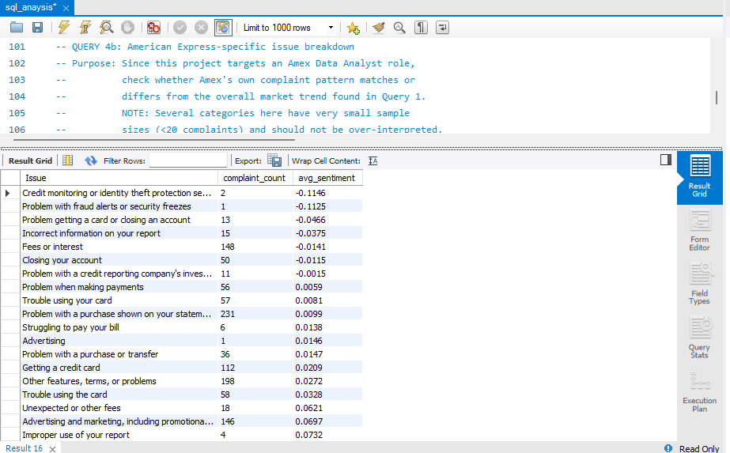
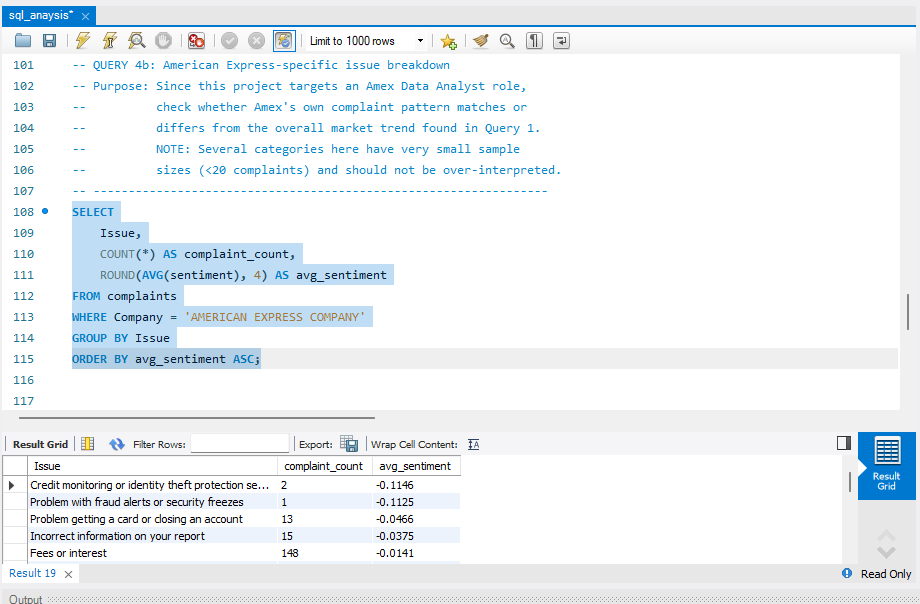

### Query 5 — Monthly Complaint Trend
Tracks whether complaint volume or sentiment is rising, falling, or stable across the dataset's date range (Jan–Aug 2023).


### Query 6 — Timely vs. Untimely Response
Checks whether late company responses correlate with worse customer sentiment — a direct servicing-quality signal. The untimely group is a very small sample, so this result is not treated as a reliable finding on its own.

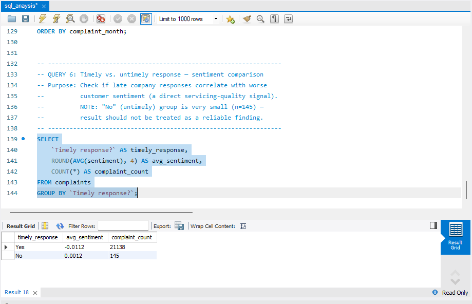

---

## Part 3 — Power BI Dashboard

The SQL/Python findings above were turned into a two-page interactive Power BI dashboard for a non-technical, executive-facing view: issue-level sentiment, top companies/states by complaint volume, and monthly trend.

**Page 1**


**Page 2**

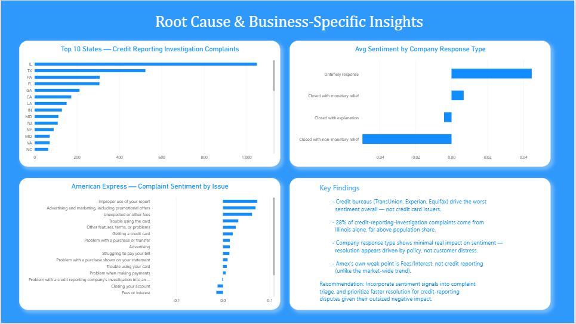

🎥 Walkthrough: `screenshot/video.mp4`


---

## Key Findings Summary

- **Worst-sentiment category:** *"Problem with a credit reporting company's investigation into an existing problem"* — driven largely by disputed late-payment marks and requests for report correction.
- **Geographic concentration:** ~28% of complaints in this category originate from Illinois alone.
- **Statistical vs. practical significance:** Resolution type is statistically associated with sentiment (p < 0.001), but the effect is small enough that it doesn't look like a meaningful CX driver on its own.
- **Company-specific pattern (Amex):** Diverges from the market — near-neutral on credit-reporting disputes, with "Fees or interest" as its most reliable negative signal.
- **Data-quality caveat surfaced by NLP:** Several narratives in the worst category are near-identical, consistent with templated dispute letters — worth accounting for before treating volume as a pure signal of organic dissatisfaction.

---

## Repository Structure

```
credit-card-cx-complaint-analysis/
│
├── credit_card_complaint_analysis.ipynb   # Full Python analysis: cleaning, sentiment, ANOVA, NLP, GenAI summary
├── sql_analysis.sql                       # SQL business queries on the cleaned dataset
├── cc_complaints_clean.csv                # Cleaned dataset (output of the notebook, input to SQL)
├── screenshot/                            # All supporting visuals referenced in this README
│   ├── screenshot_23.png, screenshot24.png, screenshot29.png   # Load & clean data, sentiment scoring
│   ├── screenshot21.png, screenshot25.png                      # Sentiment-by-issue chart + ANOVA
│   ├── screenshot22.png, screenshot26.png                      # Sentiment-by-response chart + ANOVA
│   ├── screenshot27.png, screenshot28.png                      # Word frequency + GenAI summary
│   ├── screenshot1.png ... screenshot10.png                    # SQL setup + Queries 1–6
│   ├── pic1.png, pic2.png                                      # Power BI dashboard — page 1 & 2
│   └── video1.mp4, video2.mp4                                  # Dashboard walkthrough recordings
└── README.md
```


---

## Limitations & Caveats

- Sentiment scores come from TextBlob (lexicon-based), not a trained/tuned model — quick and explainable, but less nuanced than a fine-tuned sentiment classifier.
- Some sub-categories (e.g. Amex's individual issue types) have very small sample sizes (<20 complaints) and are explicitly excluded from interpretation.
- The "Untimely response" group is a very small sample and any comparison involving it should not be treated as a reliable finding.
- Statistically significant ANOVA results are reported alongside effect size, since large sample sizes (21K+ rows) can make even trivial differences appear "significant."

---

## Why This Project

This analysis was built to demonstrate the core skills called out for CX/Customer Insights analyst roles: structuring an ambiguous question into testable hypotheses, choosing the right statistical method (and knowing its limits), applying NLP/GenAI to unstructured customer feedback, and communicating findings in both a technical (SQL/Python) and business-facing (Power BI) format.

## Author

**Shivam Gupta** B.Com (Hons) | Shaheed Bhagat Singh College, University of Delhi (2024) NISM Research Analyst Certified

📧 shivamconnect321@gmail.com &nbsp;|&nbsp; 🔗 [LinkedIn](https://www.linkedin.com/in/shivam-gupta2003) &nbsp;|&nbsp; [GitHub](https://github.com/shivamg-03)
