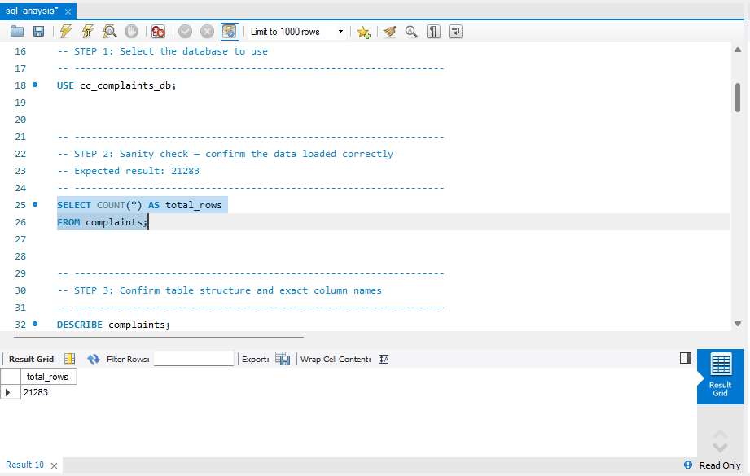
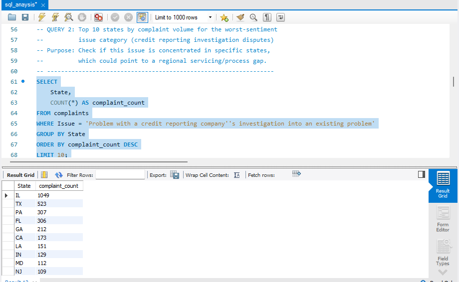
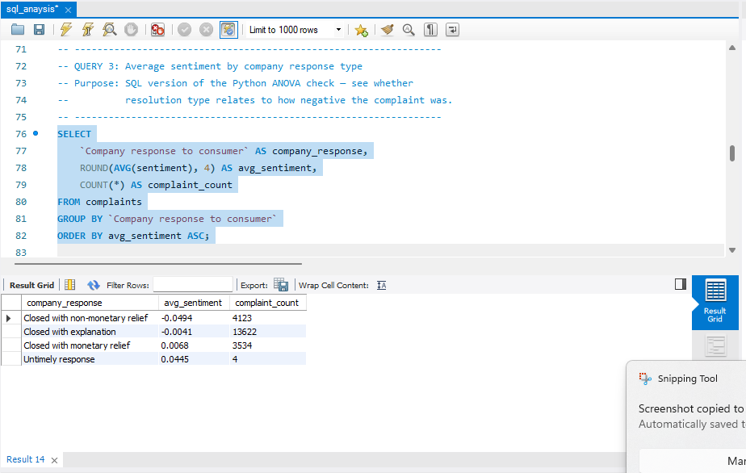
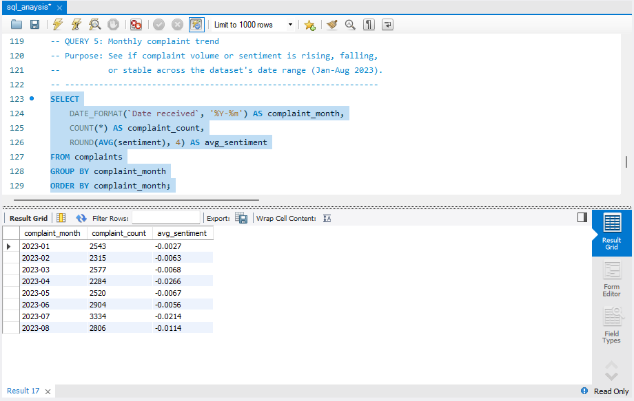

# Credit Card Customer Experience & Complaint Driver Analysis

A hypothesis-driven analysis of credit card customer complaints, combining Python (cleaning, sentiment scoring, statistical testing, NLP, GenAI summarization), SQL (structured business queries), and Power BI (stakeholder-facing dashboard) to identify what drives customer dissatisfaction and where companies should focus CX improvements.

**Built to demonstrate:** ambiguous business question → testable hypotheses → structured + unstructured data analysis → statistical validation → business recommendations — the full analyst workflow, not just visualization.

---

## Table of Contents
- [Project Overview](#project-overview)
- [Dataset](#dataset)
- [Tech Stack](#tech-stack)
- [Pipeline](#pipeline)
- [Key Findings](#key-findings)
- [Screenshots](#screenshots)
- [Recommendations](#recommendations)
- [Limitations](#limitations)
- [Repository Structure](#repository-structure)

---

## Project Overview

Credit card companies receive thousands of complaints, but most reporting stops at counting them by category. This project goes further: it asks *why* certain complaints are worse than others, tests whether the differences are statistically real, and traces the worst-performing category back to its root cause using NLP and GenAI summarization — then verifies the findings independently using SQL.

## Dataset

**Source:** [CFPB Consumer Complaint Database](https://www.consumerfinance.gov/data-research/consumer-complaints/search/?product=Credit%20card%20or%20prepaid%20card)
Public, real consumer complaints submitted to the U.S. Consumer Financial Protection Bureau.

- Filtered to: **Credit card or prepaid card** complaints with a written narrative
- Date range used: **January – August 2023** (21,283 rows) — note: the CFPB site's bulk export was found to truncate at this point during download; see [Limitations](#limitations)
- Fields used: date received, product/sub-product, issue/sub-issue, free-text narrative, company, state, company response, timely response flag

## Tech Stack

| Tool | Purpose |
|---|---|
| **Python** (pandas, numpy, scipy, TextBlob, seaborn, matplotlib) | Data cleaning, sentiment scoring, hypothesis testing, word-frequency root-cause analysis |
| **SQL** (MySQL) | Structured business queries — aggregations, state/company breakdowns, cross-validation of Python findings |
| **Power BI** | Interactive two-page dashboard for stakeholder consumption |
| **GenAI (LLM)** | Summarized free-text complaint narratives into readable themes |

## Pipeline

1. **Extract** — Bulk CSV export from CFPB, loaded via chunked pandas reading to handle a large multi-GB file without memory errors; filtered down to credit card complaints with narratives (108,683 rows), then to the usable date range (21,283 rows)
2. **Clean** — Regex removed CFPB's redaction placeholders (`XX/XX/2023`, `XXXX`) from narrative text
3. **Feature engineering** — Sentiment polarity score per complaint using TextBlob (lexicon-based, -1 to +1)
4. **Hypothesis testing** — Two one-way ANOVA tests:
   - Sentiment differs significantly by issue category (F = 112.75, p < 0.00001)
   - Sentiment vs. company response type is statistically significant but practically negligible (effect size near zero) — a deliberate statistical-vs-practical-significance callout, not a headline finding
5. **Root cause analysis** — Word-frequency analysis on the worst-sentiment category revealed a specific, concrete pattern: disputed late-payment marks, customers submitting evidence, requesting bureau investigation and removal
6. **GenAI summarization** — An LLM summarized a sample of narratives into a readable theme summary, and flagged a secondary pattern: several complaints used near-identical wording, suggesting template-based dispute letters
7. **SQL cross-validation** — Loaded the cleaned dataset into MySQL and independently re-ran the core aggregations (issue-level sentiment, state concentration, company breakdown, monthly trend) — results matched the Python output exactly, confirming pipeline integrity
8. **Visualization** — Two-page Power BI dashboard: an interactive overview page and a root-cause/business-specific deep-dive page

## Key Findings

- **Credit reporting investigation disputes are the single worst-sentiment complaint category** (avg sentiment -0.11, n=3,748) — driven specifically by disputed late-payment marks, not general credit reporting dissatisfaction.
- **Credit bureaus — not credit card issuers — drive the worst sentiment overall.** TransUnion (-0.104), Experian (-0.114), and Equifax (-0.107) are the three most negative companies in the dataset, despite this being a "credit card" complaint dataset.
- **28% of credit-reporting-investigation complaints originate from Illinois alone** — far outside what population share would predict, flagging a possible regional or company-specific servicing pattern worth further investigation.
- **Company response type has minimal real relationship to complaint sentiment.** Statistically significant (p < 0.001) but practically negligible (all group means within ±0.05 on a -1 to +1 scale) — suggesting resolution decisions are driven by policy/category, not by how upset the customer sounds. A possible CX gap: sentiment signals aren't currently used in triage.
- **American Express's own complaint pattern differs from the market-wide trend.** Amex's credit-reporting complaints run near-neutral sentiment (unlike the industry-wide worst category), while their most reliable negative signal by volume is **Fees or interest** (n=148, avg -0.014).
- **Timely vs. untimely company response shows no meaningful sentiment difference** — though the untimely group is very small (n=145) and not a reliable comparison.

## Screenshots

> Screenshots and screen recordings are stored in the `screenshots/` folder.

**Python Analysis (Jupyter Notebook)**
| | |
|---|---|
| Data loading & cleaning |  |
| Sentiment scoring |  |
| Hypothesis test — sentiment by issue |  |
| Sentiment by issue chart |  |
| Hypothesis test — sentiment by response type |  |
| Word frequency — root cause |  |
| GenAI summary |  |

**SQL Analysis (MySQL Workbench)**
| | |
|---|---|
| Table schema & row count |  |
| Query 1 — sentiment by issue |  |
| Query 2 — state concentration |  |
| Query 4 — top companies & Amex breakdown |  |
| Query 5 & 6 — monthly trend & timely response |  |

**Power BI Dashboard**
| | |
|---|---|
| Page 1 — Overview |  |
| Page 2 — Root Cause & Business Insights |  |

**Screen Recordings**
- [Dashboard Page 1 walkthrough](screenshots/video1.mp4)
- [Dashboard Page 2 walkthrough](screenshots/video2.mp4)

## Recommendations

1. **Prioritize faster resolution for credit-reporting-investigation disputes.** This category drives the worst customer sentiment by a wide margin and is concentrated in specific states (notably Illinois) — worth investigating whether this reflects a specific bureau relationship or regional servicing gap.
2. **Incorporate sentiment scoring into complaint triage.** Resolution type currently shows no meaningful relationship to how negative a complaint is — highly distressed customers aren't being flagged for differentiated handling.
3. **For Amex specifically:** the company's own credit-reporting complaints already run near-neutral, unlike the market trend — but Fees/Interest is their most reliable negative signal and the more actionable area for CX improvement.
4. **Monitor for templated/coordinated complaint patterns.** The GenAI summarization step surfaced near-identical wording across several complaints, suggesting some volume may come from credit-repair services rather than fully organic complaints — worth tracking separately from organic sentiment trends.

## Limitations

- **Date range:** The CFPB bulk CSV export unexpectedly truncated at August 2023 despite the source site showing data through August 2026 at time of download. The analysis reflects Jan–Aug 2023 only; a future iteration could pull the missing range via the CFPB API instead of the bulk web export.
- **Sentiment scoring:** TextBlob is a lexicon-based method, not a trained classifier — it's fast and fully explainable but less nuanced than transformer-based sentiment models. Chosen deliberately here for interpretability over marginal accuracy gains.
- **Small-sample categories:** Several issue/response subcategories (e.g. "Untimely response," several Amex-specific issue types) have very small sample sizes and are explicitly excluded from strong interpretation throughout the analysis.
- **Templated complaints:** A portion of the worst-sentiment category's narratives appear near-identical, likely from templated dispute letters — this may somewhat inflate the *apparent* volume of the underlying issue, though the issue itself (disputed late-payment marks) is still real and recurring.

## Repository Structure

```
credit-card-cx-complaint-analysis/
│
├── notebooks/
│   └── credit_card_complaints_analysis.ipynb
│
├── sql/
│   └── credit_card_complaints_analysis.sql
│
├── power_bi/
│   └── credit_card_cx_dashboard.pbix
│
├── data/
│   └── cc_complaints_clean.csv
│
├── screenshots/
│   ├── screenshot1.png ... screenshot14.png
│   ├── video1.mp4
│   └── video2.mp4
│
└── README.md
```

---

**Author:** Shivam Gupta
**Contact:** shivamconnect321@gmail.com | [LinkedIn](https://linkedin.com/in/shivam-gupta2003)
