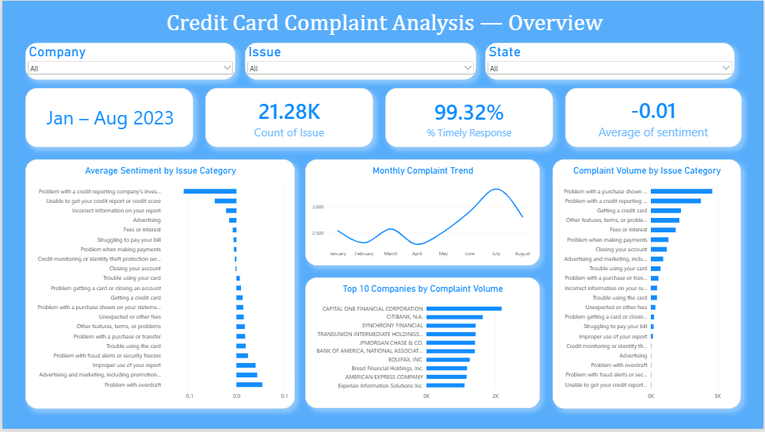

# Credit Card Customer Experience & Complaint Driver Analysis

Hypothesis-driven CX analysis of credit card complaints filed with the CFPB, combining structured metadata analysis, NLP-based sentiment scoring, SQL business queries, and a Power BI dashboard for stakeholder-facing insights.

## Objective

Identify the key drivers of customer dissatisfaction in credit card servicing by combining structured complaint metadata with free-text narrative analysis (sentiment scoring + GenAI summarization), and present the findings through interactive dashboards.

## Data Source

CFPB Consumer Complaint Database, filtered to credit card / prepaid card complaints:
[CFPB Consumer Complaint Search — Credit Card or Prepaid Card](https://www.consumerfinance.gov/data-research/consumer-complaints/search/?product=Credit%20card%20or%20prepaid%20card)

## Project Workflow

1. **Data Loading & Cleaning (Python)** — Loaded the raw CFPB export in chunks, filtered to credit card/prepaid card complaints with narratives, narrowed to 2023 onward, and cleaned CFPB's redaction placeholders (`XXXX`, `XX/XX/YYYY`) from narrative text.
2. **Sentiment Scoring (Python / TextBlob)** — Scored each complaint narrative's sentiment polarity (-1 to +1) as an explainable, lexicon-based dissatisfaction signal.
3. **Hypothesis Testing (Python / SciPy)** — Ran one-way ANOVA tests to check whether sentiment differs significantly by issue category and by company response type.
4. **Root Cause & GenAI Analysis (Python)** — Used word-frequency analysis and LLM-based summarization on the worst-sentiment issue category to surface the underlying drivers of dissatisfaction.
5. **SQL Business Queries** — Loaded the cleaned dataset into a SQL database and ran structured business queries (issue trends, state/company breakdowns, monthly trends, timely-response comparisons) to complement the Python analysis.
6. **Power BI Dashboard** — Built a two-page interactive dashboard to present the findings visually.

## Repository Structure

```
├── Untitled.ipynb          # Python notebook: data cleaning, sentiment scoring, hypothesis testing, GenAI summary
├── sql_anaysis.sql         # SQL queries on the cleaned complaint dataset
├── screenshot/
│   ├── page1.png           # Power BI dashboard — Page 1
│   ├── page2.png           # Power BI dashboard — Page 2
│   ├── video1.mp4          # Dashboard walkthrough — Part 1
│   └── video2.mp4          # Dashboard walkthrough — Part 2
└── README.md
```

## Dashboard Preview

**Page 1**


**Page 2**


## Dashboard Walkthrough (Video)

- [Video 1 — Dashboard Walkthrough Part 1](screenshot/video1.mp4)
- [Video 2 — Dashboard Walkthrough Part 2](screenshot/video2.mp4)

> Note: GitHub does not render embedded `.mp4` playback inline in the README — click the links above to download/view, or embed via a hosted link (e.g. YouTube, Loom) if preferred.

## Key Findings

- **Worst-sentiment issue category:** "Problem with a credit reporting company's investigation into an existing problem" — driven primarily by disputed late-payment marks, with customers submitting documentation and requesting removal from their credit report.
- **Statistically significant, but practically small, differences** in sentiment across both issue category and company response type (ANOVA p < 0.001 in both cases) — with all mean differences across response types within ±0.05 on a -1 to +1 scale, suggesting resolution decisions are likely policy-driven rather than sentiment-driven.
- **Geographic concentration:** A disproportionate share of "credit reporting investigation" complaints originate from Illinois relative to population share.
- **Company-specific pattern (American Express):** Amex's own worst category by volume is "Fees or interest," diverging from the market-wide worst category — highlighting the value of company-level cuts over aggregate trends.
- **Narrative pattern:** Several low-sentiment narratives are near-identical in wording, suggesting a portion may originate from template-based dispute letters rather than fully original complaints.

## Tools & Technologies

- **Python:** pandas, NumPy, TextBlob, SciPy, Seaborn, Matplotlib
- **SQL:** structured business queries on cleaned complaint data
- **Power BI:** interactive dashboard for stakeholder-facing insights

## Links

- **Dataset:** [CFPB Consumer Complaint Database](https://www.consumerfinance.gov/data-research/consumer-complaints/search/?product=Credit%20card%20or%20prepaid%20card)
- **GitHub:** [github.com/shivamg-03](https://github.com/shivamg-03)
- **LinkedIn:** [linkedin.com/in/shivam-gupta2003](https://www.linkedin.com/in/shivam-gupta2003)
